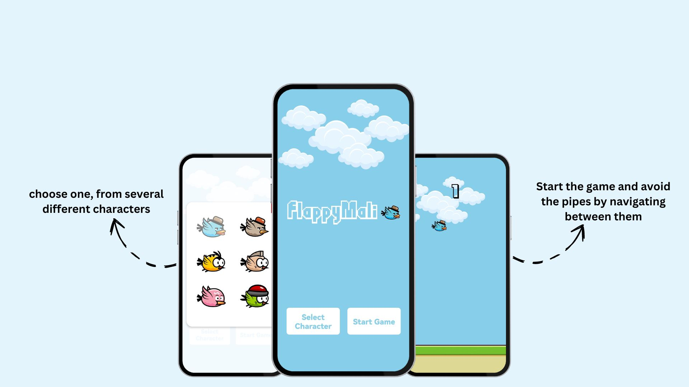

# FlappyMali game

> This is a **FlappyBird**-inspired game built with **React Native**, **Skia**, and **Reanimated**. The game allows users to select their character, tracks high scores, and features like: realistic physics with gravity and sound effects.



This game is a customized version of the classic FlappyBird game, based on a project tutorial from a YouTube video. While following the core mechanics from the video, I have added several unique features to enhance the game play experience.


Inspired by the "Build Flappy Bird with React Native: Skia & Reanimated Tutorial" a tutorial from notJust.dev on the youtube platform, this project extends the basic mechanics with additional features and customizations. You can find the youtube tutorial in [here](https://www.youtube.com/live/9F4aICEisVI?si=Lt17vtKNOrK4reD0)


<!-- tocstop -->

## Features

- **Character Selection**: Players can choose their character at the start of the game.
- **High Score Tracking**: The game tracks the player's high score.
- **Sound Effects**: 
  - A sound plays when the bird successfully passes through pipes.
  - A sound is triggered when the player loses the game.
- **Gravity Simulation**: The bird falls towards the ground if the player doesn’t tap the screen to keep it in the air.
- **Smooth Animations**: Powered by Skia and Reanimated for a seamless experience.

## Gameplay

- Tap the screen to make the bird fly up.
- Avoid the pipes by navigating between them.
- The game gets progressively harder and faster as you continue.
- Try to beat your high score!


## Installation

1. Clone the repository:
   ```bash
   git clone https://github.com/siboraberishaa/FlappyMali.git
   cd FlappyMali-master


### Install Dependencies

```
cd FlappyMali-master
cd game
npm install
````

```


## License

The MIT License

Copyright (c) 2024 Sibora Berisha https://www.linkedin.com/in/sibora-berisha-9b863b274/

Feel free to adjust it based on your specific project and add sections for screenshots or a demo if you like!